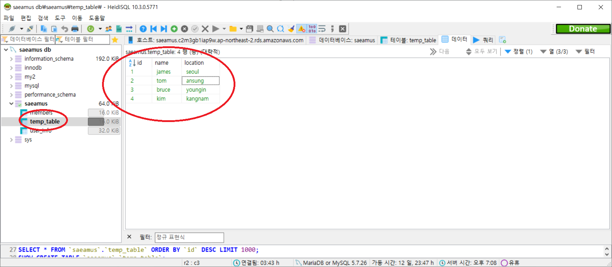
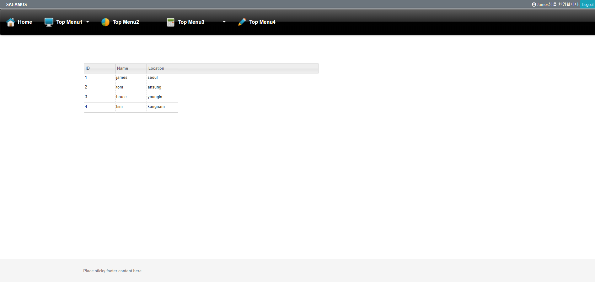

#### 20200310 원래글 내용은 doc/004b.어플리케이션의 생성 및 폴더의 구조.md 로 이동하였습니다.

#### 앞으로 여기서는 작업 진행상황에 따라 commit되는 파일들에 대해 간략한 설명을 하도록 할 예정입니다.

# 목차

[1.commit명: slickgrid test on t1sub1sub1 menu(1)](#slickgrid-test-on-t1sub1sub1-menu-1)

[2.commit명: slickgrid test on t1sub1sub1 menu(2)](#slickgrid-on-t1sub1sub1-menu-2)

[3.commit명: T1SUB1SUB2 페이지에 db table로 부터 Grid 띄우기](#t1sub1sub2-grid-from-db-table)

[4.commit명: T1SUB1SUB3 페이지 Grid에서 db CRUD 구현 ](#t1sub1sub3-grid-crud)

# 설명

# slickgrid test on t1sub1sub1 menu 1

commit을 한번에 처리해버려서 1,2차로 나누어서 설명합니다.

#### 목적 :

slickgrid를 t1sub1sub1 메뉴페이지에 연결하기 위한 test 작업입니다.
삽입할 Grid는 slickgrid의 simple예제입니다.  
 예제 링크:  
 <http://6pac.github.io/SlickGrid/examples/example1-simple.html>

#### 설명 :

1.  slickgrid를 install 합니다.

        npm install slickgrid

2.  view 폴더에 테스트용으로 layout-grid1.ejs 파일을 생성하고
    <https://github.com/6pac/SlickGrid/blob/master/examples/example1-simple.html>  
    로부터 html source를 복사해서 붙입니다.

3.  "head"와 "body"태그안의 link 되어있는 파일들을 local 폴더에 복사하고 경로를 수정합니다.

4.  route/module.js에서 router.get("/t1sub1sub1" ....의 라우팅 부분을 아래와 같이 수정합니다.

        수정전
        res.render("layout", { name: username, title: url2, content: t1sub1sub1_ren });
        });

        수정후
        res.render("layout-grid1", { name: username, title: url2, content: t1sub1sub1_ren });
        });

5.  프로젝트를 실행합니다.

        npm start

6.  화면에 메뉴바 없이 grid가 뜨면 성공입니다.

# slickgrid on t1sub1sub1 menu 2

#### 목적 :

slickgrid를 layout을 적용하여 t1sub1sub1 메뉴페이지에 연결하기 위한 test 작업입니다.(1번과 다른 점은 페이지 상하단에 header, menu, footer 레이아웃이 적용되고 grid는 본문 영역에 보여집니다)
삽입할 Grid는 slickgrid의 simple예제입니다.  
 예제 링크:  
 <http://6pac.github.io/SlickGrid/examples/example1-simple.html>

#### 설명 :

1.  slickgrid를 install 합니다.(생략)

        npm install slickgrid

2.  view 폴더에 테스트용으로 layout-grid2.ejs 파일을 생성하고
    <https://github.com/6pac/SlickGrid/blob/master/examples/example1-simple.html>  
    로부터 html source를 복사해서 붙입니다.

    view/layout.ejs의 내용을 layout-grid2.ejs에 복사해서 추가로 붙입니다.

3.  각 "head"와 "body"태그안의 link 되어있는 파일들을 하나의 html문서로 합칩니다.

4.  view/m-t1sub1sub1.ejs파일의 내용을  
    예제 링크:  
    <http://6pac.github.io/SlickGrid/examples/example1-simple.html>
    의 본문 부분만 복사해서 붙입니다.(여기서는 body의 table태그 부분만 복사함)

5.  route/module.js에서 router.get("/t1sub1sub1" ....의 라우팅 부분을 아래와 같이 수정합니다.

        수정전
        res.render("layout-grid1", { name: username, title: url2, content: t1sub1sub1_ren });
        });

        수정후
        res.render("layout-grid2", { name: username, title: url2, content: t1sub1sub1_ren });
        });

6.  프로젝트를 실행합니다.

        npm start

7.  화면과 같이 메뉴바와 함께 grid가 뜨면 성공입니다.  
    

8.  서버 http://15.164.212.170:8000 에 접속해서 T1SUB1SUB1메뉴 페이지로 이동하면 확인 됩니다.

# T1SUB1SUB2 grid from db table

#### 목적

T1SUB1SUB2 메뉴 페이지에
DB table로 부터 data를 불러들여 grid를 만드는 작업입니다.

#### 설명

1.  AWS db에 temp_table(column = id,name,location)을 만들고 data를 몇개 입력합니다.

    

2.  m1-t1sub1sub2.ejs 파일을 아래와 같이 수정합니다.

    AJAX get을 사용하여 db의 data를 불러 옵니다.  
    ajax에서 async:true이면 javascript 특성상 db에서 data를 가져오기 전에 아래 라인을 실행해서 grid를 그려버립니다.그러면 나중에 data를 가져와도 로딩 안됩니다.무조건 async:false로 셋팅해야합니다.
    기본페이지가 그려진후 grid를 그리기위해 별도의 modules/t1sub1sub2/get으로 라우팅합니다.

         

3.  modules.js파일을 아래와 같이 수정합니다.
    AJAX GET METHOD로 라우팅되어 db의 temp_table에서 data를가져옵니다.

         router.get("/t1sub1sub2/get", function(req, res) {
         var sql = "select * from temp_table";
         mysqlDB.query(sql, function(err, results) {
            if (err) {
                 res.send("error : " + err);
            }
            if (!results[0]) {
                 res.send("nodata");
            }
            //console.log(results);
            res.send(results);
           });
         });

4)  화면과 같이 메뉴바와 함께 db에서 불러온 data로 grid가 뜨면 성공입니다.  
    

# T1SUB1SUB3 GRID CRUD

#### 목적

T1SUB1SUB3 메뉴페이지에 Grid상에서 CRUD를 구현합니다.

#### 설명

코드 작성중입니다....
